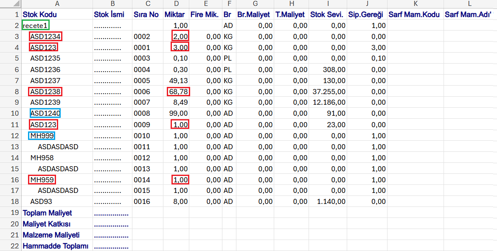
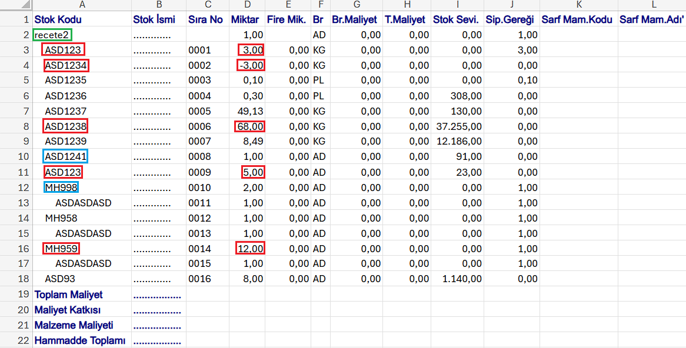

# Netsis-Recete-Karsilastirma-Araci
Netsis programından alınan reçetelerdeki farklılıkları tespit eden basit bir uygulama...

Reçetedeki alt kırılımları yok eder, reçetelerdeki farklı stok kodlu malzemelerin ve 
ayni stok kodlu farklı sayıdaki 

    
    

    
    

